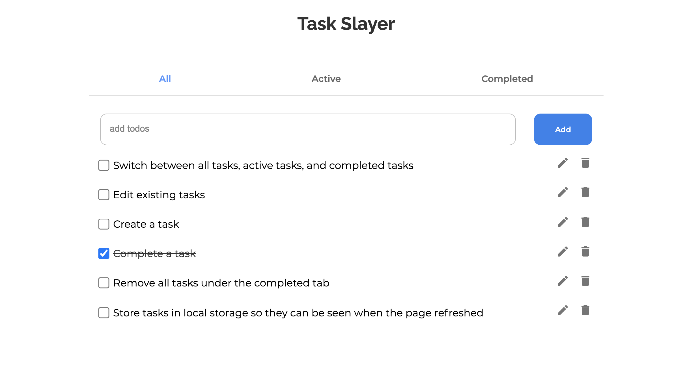
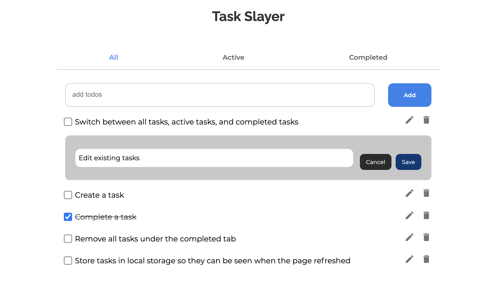
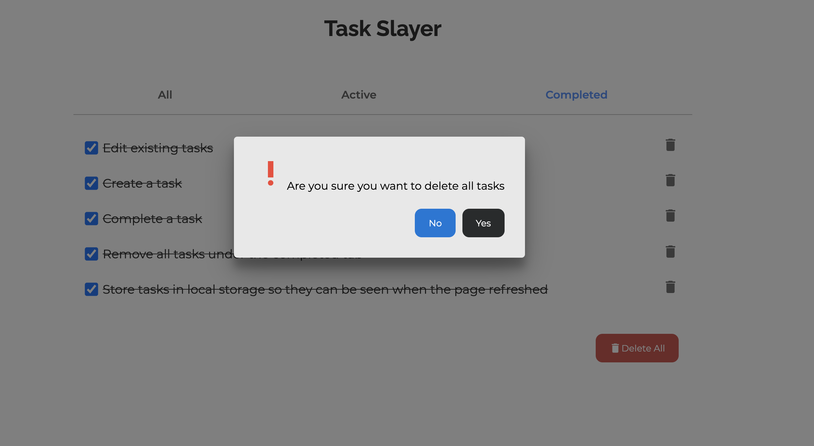

<!-- Please update value in the {}  -->

<h1 align="center">Task Slayer</h1>

<div align="center">
   Solution for a challenge from  <a href="http://devchallenges.io" target="_blank">Devchallenges.io</a>.
</div>

<div align="center">
  <h3>
    <span> | </span>
    <a href="https://task-slayer-70909.herokuapp.com">
      Solution
    </a>
    <span> | </span>
    <a href="https://devchallenges.io/challenges/hH6PbOHBdPm6otzw2De5">
      Challenge
    </a>
  </h3>
</div>

<!-- TABLE OF CONTENTS -->

## Table of Contents

- [Overview](#overview)
  - [Built With](#built-with)
- [Features](#features)
- [How to use](#how-to-use)
- [Contact](#contact)
- [Acknowledgements](#acknowledgements)

<!-- OVERVIEW -->

## Overview





- You can [click here](https://task-slayer-70909.herokuapp.com/) to see the app demo
- I am teaching myself front-end web development and now my main focus is React.
- Through building this app, I have a better understanding of React Hooks and responsive web-development.

### Built With

<!-- This section should list any major frameworks that you built your project using. Here are a few examples.-->

- [React](https://reactjs.org/)

## Features

<!-- List the features of your application or follow the template. Don't share the figma file here :) -->

This application/site was created as a submission to a [DevChallenges](https://devchallenges.io/challenges) challenge. The original [challenge](https://devchallenges.io/challenges/hH6PbOHBdPm6otzw2De5) was to build an application to complete the given user stories. This app modifies several features. Now you can use this app to:

- Create a new task
- Switch between all tasks, active tasks, and completed tasks
- Delete a task under either tab of all, active, and completed tasks
- Edit an existing task under all and active tab
- Store data in local storage so that tasks can still be seen when the page gets refreshed

## How To Use

<!-- Example: -->

To clone and run this application, you'll need [Git](https://git-scm.com) and [Node.js](https://nodejs.org/en/download/) (which comes with [npm](http://npmjs.com)) installed on your computer. From your command line:

```bash
# Clone this repository
$ git clone https://github.com/sunmengyue/my-todo-app.git

# Install dependencies
$ npm install

# Run the app
$ npm start
```

Notice that The branch I finally deployed is **pureHTMLCss**.

## Acknowledgements

<!-- This section should list any articles or add-ons/plugins that helps you to complete the project. This is optional but it will help you in the future. For example: -->

- [Node.js](https://nodejs.org/)
- [Marked - a markdown parser](https://github.com/chjj/marked)
- [React](https://reactjs.org/)

## Contact

- GitHub [@sunmengyue](https://github.com/sunmengyue)
